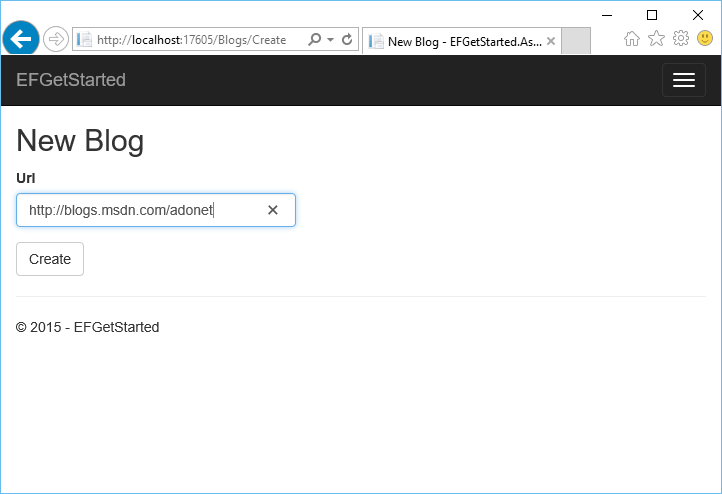
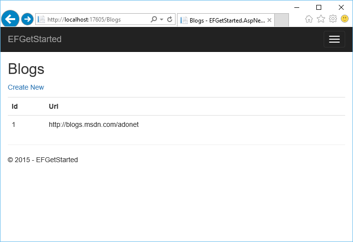

---
title: ASP.NET Core Application to New Database
author: rowanmiller
ms.author: rowmil
manager: rowanmiller
ms.date: 10/27/2016
ms.topic: article
ms.assetid: e153627f-f132-4c11-b13c-6c9a607addce
ms.prod: entity-framework-core-
uid: core/get-started/aspnetcore/new-db
---
# ASP.NET Core Application to New Database

> [!WARNING]
> This documentation is for EF Core. For EF6.x and earlier release see [http://msdn.com/data/ef](http://msdn.com/data/ef).

In this walkthrough, you will build an ASP.NET Core MVC application that performs basic data access using Entity Framework. You will use migrations to create the database from your model.

> [!TIP]
> You can view this article's [sample](https://github.com/aspnet/EntityFramework.Docs/tree/master/samples/core/GetStarted/AspNetCore/AspNetCore.NewDb) on GitHub.

## Prerequisites

The following prerequisites are needed to complete this walkthrough:

* [Visual Studio 2015 Update 3](https://go.microsoft.com/fwlink/?LinkId=691129)

* [.NET Core for Visual Studio](https://go.microsoft.com/fwlink/?LinkId=817245)

## Create a new project

* Open Visual Studio 2015

* File ‣ New ‣ Project...

* From the left menu select Templates ‣ Visual C# ‣ Web

* Select the **ASP.NET Core Web Application (.NET Core)** project template

* Enter **EFGetStarted.AspNetCore.NewDb** as the name and click **OK**

* Wait for the **New ASP.NET Core Web Application** dialog to appear

* Select the **Web Application** template and ensure that **Authentication** is set to **No Authentication**

* Click **OK**

> [!WARNING]
> If you use **Individual User Accounts** instead of **None** for **Authentication** then an Entity Framework model will be added to your project in *Models\IdentityModel.cs*. Using the techniques you will learn in this walkthrough, you can choose to add a second model, or extend this existing model to contain your entity classes.

## Install Entity Framework

To use EF Core, install the package for the database provider(s) you want to target. This walkthrough uses SQL Server. For a list of available providers see [Database Providers](../../providers/index.md).

* Tools ‣ NuGet Package Manager ‣ Package Manager Console

* Run `Install-Package Microsoft.EntityFrameworkCore.SqlServer`

> [!NOTE]
> In ASP.NET Core projects the `Install-Package` command will complete quickly and the package installation will occur in the background. You will see **(Restoring...)** appear next to **References** in **Solution Explorer** while the install occurs.

Later in this walkthrough we will also be using some Entity Framework commands to maintain the database. So we will install the commands package as well.

* Run `Install-Package Microsoft.EntityFrameworkCore.Tools –Pre`

* Open **project.json**

* Locate the `tools` section and add the `ef` command as shown below

<!-- [!code-json[Main](samples/core/GetStarted/AspNetCore/AspNetCore.NewDb/project.json?highlight=2)] -->
````json
  "tools": {
    "Microsoft.EntityFrameworkCore.Tools": "1.0.0-preview2-final",
    "Microsoft.AspNetCore.Razor.Tools": "1.0.0-preview2-final",
    "Microsoft.AspNetCore.Server.IISIntegration.Tools": "1.0.0-preview2-final"
  },
````

## Create your model

Now it's time to define a context and entity classes that make up your model.

* Right-click on the project in **Solution Explorer** and select Add ‣ New Folder

* Enter **Models** as the name of the folder

* Right-click on the **Models** folder and select Add ‣ New Item...

* From the left menu select Installed ‣ Code

* Select the **Class** item template

* Enter **Model.cs** as the name and click **OK**

* Replace the contents of the file with the following code

<!-- [!code-csharp[Main](samples/core/GetStarted/AspNetCore/AspNetCore.NewDb/Models/Model.cs)] -->
````csharp
using Microsoft.EntityFrameworkCore;
using System.Collections.Generic;

namespace EFGetStarted.AspNetCore.NewDb.Models
{
    public class BloggingContext : DbContext
    {
        public BloggingContext(DbContextOptions<BloggingContext> options)
            : base(options)
        { }

        public DbSet<Blog> Blogs { get; set; }
        public DbSet<Post> Posts { get; set; }
    }

    public class Blog
    {
        public int BlogId { get; set; }
        public string Url { get; set; }

        public List<Post> Posts { get; set; }
    }

    public class Post
    {
        public int PostId { get; set; }
        public string Title { get; set; }
        public string Content { get; set; }

        public int BlogId { get; set; }
        public Blog Blog { get; set; }
    }
}
````

> [!NOTE]
> In a real application you would typically put each class from your model in a separate file. For the sake of simplicity, we are putting all the classes in one file for this tutorial.

## Register your context with dependency injection

The concept of dependency injection is central to ASP.NET Core. Services (such as `BloggingContext`) are registered with dependency injection during application startup. Components that require these services (such as your MVC controllers) are then provided these services via constructor parameters or properties. For more information on dependency injection see the [Dependency Injection](http://docs.asp.net/en/latest/fundamentals/dependency-injection.html) article on the ASP.NET site.

In order for our MVC controllers to make use of `BloggingContext` we are going to register it as a service.

* Open **Startup.cs**

* Add the following `using` statements at the start of the file

<!-- [!code-csharp[Main](samples/core/GetStarted/AspNetCore/AspNetCore.NewDb/Startup.cs)] -->
````csharp
using EFGetStarted.AspNetCore.NewDb.Models;
using Microsoft.EntityFrameworkCore;
````

Now we can use the `AddDbContext` method to register it as a service.

* Locate the `ConfigureServices` method

* Add the lines that are highlighted in the following code

<!-- [!code-csharp[Main](samples/core/GetStarted/AspNetCore/AspNetCore.NewDb/Startup.cs?highlight=3,4)] -->
````csharp
public void ConfigureServices(IServiceCollection services)
{
    var connection = @"Server=(localdb)\mssqllocaldb;Database=EFGetStarted.AspNetCore.NewDb;Trusted_Connection=True;";
    services.AddDbContext<BloggingContext>(options => options.UseSqlServer(connection));
````

## Create your database

Now that you have a model, you can use migrations to create a database for you.

* Tools –> NuGet Package Manager –> Package Manager Console

* Run `Add-Migration MyFirstMigration` to scaffold a migration to create the initial set of tables for your model. If you receive an error stating the term 'add-migration' is not recognized as the name of a cmdlet, then close and reopen Visual Studio

* Run `Update-Database` to apply the new migration to the database. Because your database doesn't exist yet, it will be created for you before the migration is applied.

> [!TIP]
> If you make future changes to your model, you can use the `Add-Migration` command to scaffold a new migration to make the corresponding schema changes to the database. Once you have checked the scaffolded code (and made any required changes), you can use the `Update-Database` command to apply the changes to the database.
>
>EF uses a `__EFMigrationsHistory` table in the database to keep track of which migrations have already been applied to the database.

## Create a controller

Next, we'll add an MVC controller that will use EF to query and save data.

* Right-click on the **Controllers** folder in **Solution Explorer** and select Add ‣ New Item...

* From the left menu select Installed ‣ Server-side

* Select the **Class** item template

* Enter **BlogsController.cs** as the name and click **OK**

* Replace the contents of the file with the following code

<!-- [!code-csharp[Main](samples/core/GetStarted/AspNetCore/AspNetCore.NewDb/Controllers/BlogsController.cs)] -->
````csharp
using EFGetStarted.AspNetCore.NewDb.Models;
using Microsoft.AspNetCore.Mvc;
using System.Linq;

namespace EFGetStarted.AspNetCore.NewDb.Controllers
{
    public class BlogsController : Controller
    {
        private BloggingContext _context;

        public BlogsController(BloggingContext context)
        {
            _context = context;
        }

        public IActionResult Index()
        {
            return View(_context.Blogs.ToList());
        }

        public IActionResult Create()
        {
            return View();
        }

        [HttpPost]
        [ValidateAntiForgeryToken]
        public IActionResult Create(Blog blog)
        {
            if (ModelState.IsValid)
            {
                _context.Blogs.Add(blog);
                _context.SaveChanges();
                return RedirectToAction("Index");
            }

            return View(blog);
        }

    }
}
````

You'll notice that the controller takes a `BloggingContext` as a constructor parameter. ASP.NET dependency injection will take care of passing an instance of `BloggingContext` into your controller.

The controller contains an `Index` action, which displays all blogs in the database, and a `Create` action, which inserts a new blogs into the database.

## Create views

Now that we have a controller it's time to add the views that will make up the user interface.

We'll start with the view for our `Index` action, that displays all blogs.

* Right-click on the **Views** folder in **Solution Explorer** and select Add ‣ New Folder

* Enter **Blogs** as the name of the folder

* Right-click on the **Blogs** folder and select Add ‣ New Item...

* From the left menu select Installed ‣ ASP.NET

* Select the **MVC View Page** item template

* Enter **Index.cshtml** as the name and click **Add**

* Replace the contents of the file with the following code

<!-- [!code-html[Main](samples/core/GetStarted/AspNetCore/AspNetCore.NewDb/Views/Blogs/Index.cshtml)] -->
````html
@model IEnumerable<EFGetStarted.AspNetCore.NewDb.Models.Blog>

@{
    ViewBag.Title = "Blogs";
}

<h2>Blogs</h2>

<p>
    <a asp-controller="Blogs" asp-action="Create">Create New</a>
</p>

<table class="table">
    <tr>
        <th>Id</th>
        <th>Url</th>
    </tr>

    @foreach (var item in Model)
    {
        <tr>
            <td>
                @Html.DisplayFor(modelItem => item.BlogId)
            </td>
            <td>
                @Html.DisplayFor(modelItem => item.Url)
            </td>
        </tr>
    }
</table>
````

We'll also add a view for the `Create` action, which allows the user to enter details for a new blog.

* Right-click on the **Blogs** folder and select Add ‣ New Item...

* From the left menu select Installed ‣ ASP.NET Core

* Select the **MVC View Page** item template

* Enter **Create.cshtml** as the name and click **Add**

* Replace the contents of the file with the following code

<!-- [!code-html[Main](samples/core/GetStarted/AspNetCore/AspNetCore.NewDb/Views/Blogs/Create.cshtml)] -->
````html
@model EFGetStarted.AspNetCore.NewDb.Models.Blog

@{
    ViewBag.Title = "New Blog";
}

<h2>@ViewData["Title"]</h2>

<form asp-controller="Blogs" asp-action="Create" method="post" class="form-horizontal" role="form">
    <div class="form-horizontal">
        <div asp-validation-summary="All" class="text-danger"></div>
        <div class="form-group">
            <label asp-for="Url" class="col-md-2 control-label"></label>
            <div class="col-md-10">
                <input asp-for="Url" class="form-control" />
                <span asp-validation-for="Url" class="text-danger"></span>
            </div>
        </div>
        <div class="form-group">
            <div class="col-md-offset-2 col-md-10">
                <input type="submit" value="Create" class="btn btn-default" />
            </div>
        </div>
    </div>
</form>
````

## Run the application

You can now run the application to see it in action.

* Debug ‣ Start Without Debugging

* The application will build and open in a web browser

* Navigate to **/Blogs**

* Click **Create New**

* Enter a **Url** for the new blog and click **Create**




